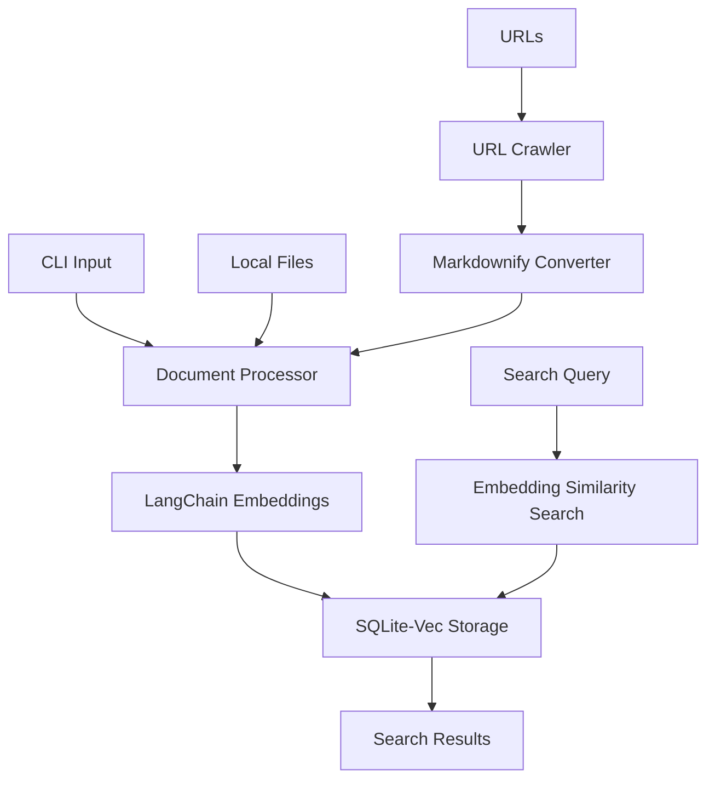

# kcli

A local knowledge base CLI tool that prioritizes privacy while helping you organize knowledge around your codebase and local files. 

## Description

kcli is a command-line tool that allows you to:
- Build and maintain a private, local knowledge base
- Index and search through your codebase and local documentation
- Crawl and archive specified URLs for offline reference
- Search through your knowledge base using embedding similarity matching for more accurate results
- Keep all your data local and private - no cloud dependencies

The tool is designed for developers who want to maintain searchable documentation and knowledge while keeping sensitive information secure and locally stored.

## Architecture

### Components

- **Document Processor**: Handles various input sources including local files, code, and web content
- **LangChain Embeddings**: Converts text content into vector embeddings for semantic search 
- **Storage Layer**:
  - SQLite database for document metadata and content
  - hnswlib index for fast approximate nearest neighbor search
  - No cloud dependencies, everything stays on your machine
- **URL Crawler & Converter**: 
  - Fetches web content while respecting robots.txt
  - Uses markdownify to convert HTML to clean markdown
  - Preserves essential content structure and links
  - Strips unnecessary styling and scripts
  - Stores standardized markdown format in knowledge base

### Data Flow
1. Input Processing:
   - Local files are read directly
   - URLs are crawled and HTML is converted to markdown via markdownify
   - Code files are processed with syntax awareness
2. Documents are processed and converted to embeddings via LangChain
3. Embeddings are created for the document content
4. Embeddings and metadata are stored in SQLite while vectors are indexed in hnswlib
5. Search queries are converted to embeddings
6. Similarity matching finds relevant content using hnswlib's approximate nearest neighbor search
7. Results are returned ranked by relevance

# Dependency management
- We use poetry to manage depedencies for this project
