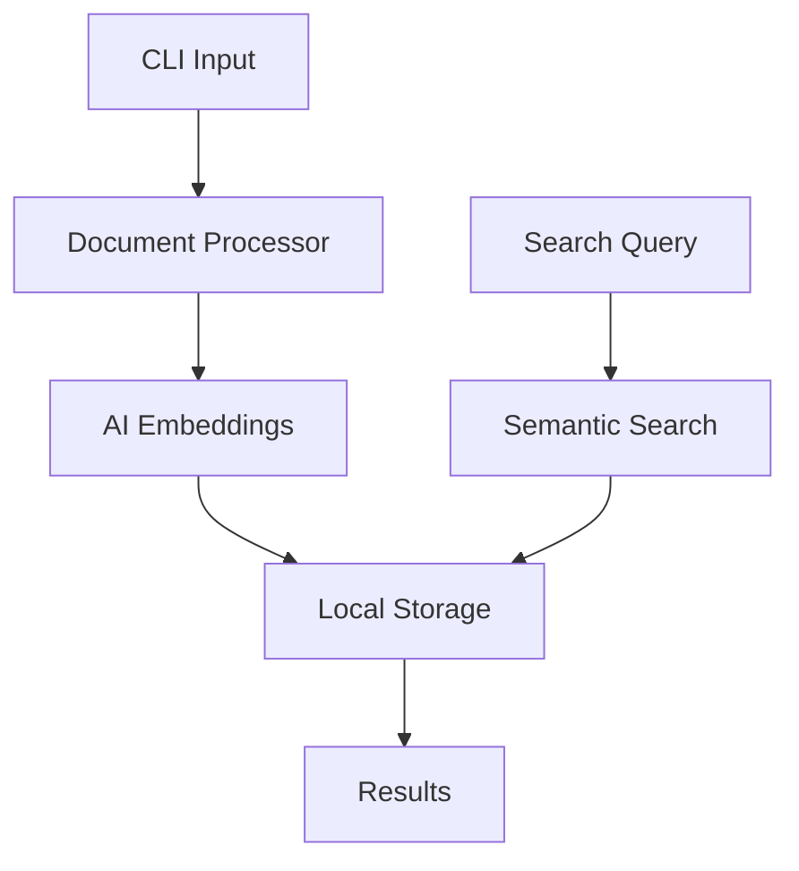

# kcli 🧠

Your personal, privacy-focused knowledge companion! Store, search and organize your knowledge without leaving the terminal.

## ✨ Features

- 🔒 **100% Private**: All data stays on your machine - no cloud, no tracking
- 🔍 **Smart Search**: Uses AI embeddings for semantic search capabilities
- 📚 **Multi-source**: Index local files, web pages, and documentation
- ⚡ **Lightning Fast**: Built with hnswlib for rapid similarity search
- 🎯 **Developer Focused**: Perfect for codebases and technical documentation
- 🔄 **Format Friendly**: Handles markdown, code, and web content seamlessly

## 🚀 Quick Start

### Installation

```bash
# Using pip
pip install kcli

# Using poetry (recommended)
poetry add kcli
```

### Basic Usage

```bash
# Add a local file to your knowledge base
kcli add README.md

# Add a webpage
kcli web https://docs.python.org/3/tutorial/

# Search your knowledge base
kcli search "how to handle exceptions in Python"

# View knowledge base stats
kcli stats
```

## 🎯 Use Cases

- 📝 Keep track of useful code snippets and solutions
- 📚 Build a personal documentation hub
- 🌐 Save web articles for offline reference
- 🔍 Search across all your technical notes
- 📖 Create a searchable knowledge archive

## 🏗 How It Works

kcli uses a sophisticated architecture to make your knowledge searchable and accessible:

1. 📥 **Input Processing**: Documents (files/web pages) are processed and cleaned
2. 🧮 **Embedding Generation**: Content is converted to vector embeddings using AI
3. 📊 **Smart Storage**: Uses SQLite + hnswlib for efficient storage and retrieval
4. 🔍 **Semantic Search**: Finds relevant content based on meaning, not just keywords



## 🛠 Commands

### `kcli add <file>`
Add local files to your knowledge base
```bash
kcli add documentation.md
```

### `kcli web <url>`
Archive web pages
```bash
kcli web https://python.org
```

### `kcli search <query>`
Search your knowledge base
```bash
kcli search "python decorators example"
```

### `kcli stats`
View knowledge base statistics
```bash
kcli stats
```

## 🔐 Privacy First

kcli is designed with privacy in mind:
- No cloud dependencies
- No data leaving your machine
- No tracking or telemetry
- Local SQLite database
- You own your data

## 🤝 Contributing

We love contributions! Here's how you can help:

1. Fork the repository
2. Create your feature branch (`git checkout -b feature/AmazingFeature`)
3. Commit your changes (`git commit -m 'Add some AmazingFeature'`)
4. Push to the branch (`git push origin feature/AmazingFeature`)
5. Open a Pull Request

## 📝 License

This project is licensed under the MIT License - see the LICENSE file for details.

## 🌟 Show Your Support

If you find kcli useful, please give it a star on GitHub! It helps others discover the project.

---

Built with ❤️ for developers who value privacy and efficiency.
